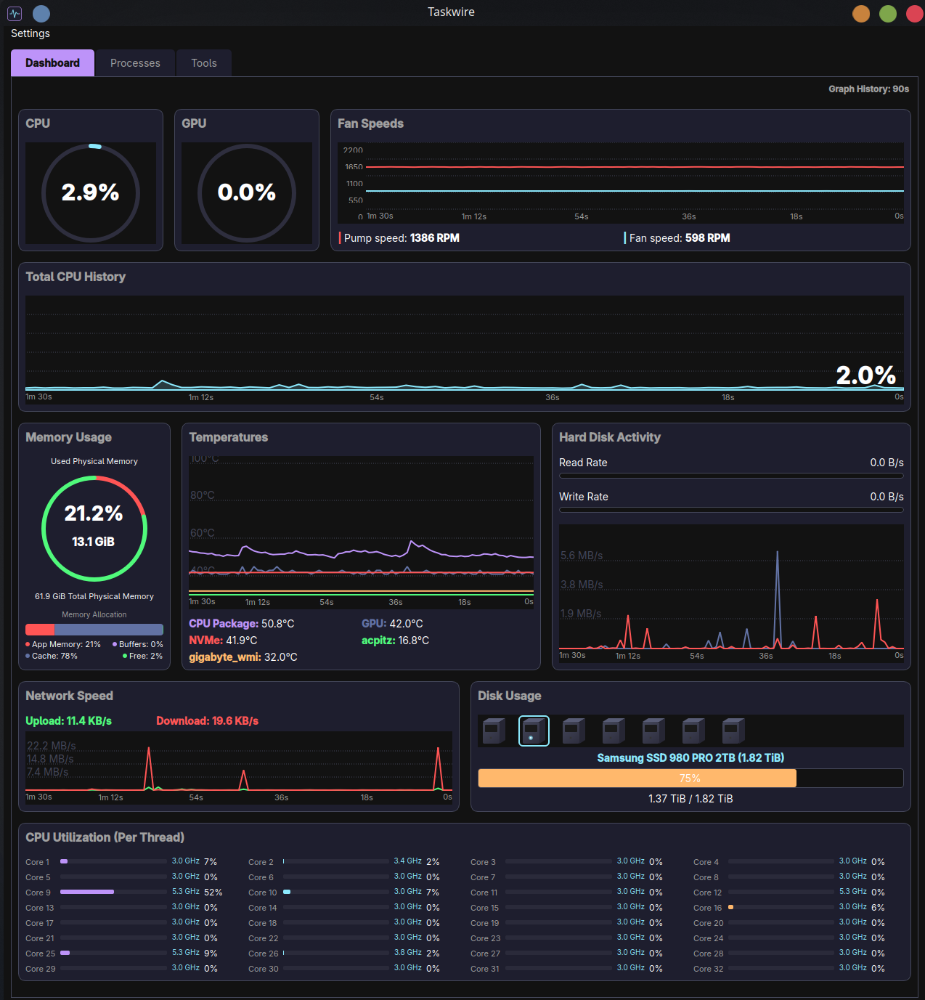

# Taskwire


> **⚠️ Disclaimer:** This is an AI "vibe coded" project, and my first attempt at making something useful with it.

**Taskwire** is a modern, dark-themed system monitor for Linux, designed with a "Video Game HUD" aesthetic. It provides real-time monitoring of your system's performance with a visual style inspired by cyberpunk interfaces and modern desktop widgets.

> **📥 [Download the latest standalone executable (No Python required)] (Now compiled in C++!) https://github.com/majoraexp/Taskwire/releases)**




*The Process Manager with normalized memory tracking.*

## 🚀 Features

*   **HUD-Style Dashboard:** A cohesive, single-window interface with a Dracula-inspired dark theme and neon accents.
*   **Live Monitoring:**
    *   **Extended History:** Customizable graph duration (60s, 90s, **30 Minutes**) for long-term trend spotting.
    *   **CPU:** Overall usage with a large percentage overlay, per-core utilization bars with frequency (MHz/GHz), and live history.
    *   **Memory:** Interactive circular gauge showing Physical Memory (RAM) usage with allocation breakdown legend.
    *   **GPU:** Real-time GPU utilization gauge (NVIDIA).
    *   **Disk:** 3D isometric drive icons for physical disks and a real-time **Read/Write Speed Graph**.
    *   **Network:** Real-time upload and download speed history graph.
    *   **Thermals:** Live temperature graphs for CPU, GPU, and motherboard sensors with per-sensor color coding.
    *   **Fans:** Live RPM monitoring graph for system fans.
    *   **Enhanced Visuals:** X-axis time indicators, vertical hover lines, and dynamic tooltips on all graphs.
*   **Process Manager:**
    *   Full list of running processes.
    *   **Customizable Metrics:** Right-click headers to toggle columns and arrange metrics to your liking.
    *   **Sortable Columns:** Click headers to sort by CPU, Memory, PID, or Name.
    *   **Normalized Memory:** Process memory metrics (Resident, Shared) are dynamically scaled to match system total.
    *   **Clean Visualization:** Simplified text-based view (no visual clutter) for easier reading of metrics.
    *   **Swap Monitoring:** Tracks Swap usage per process.
    *   **Grouping:** Collapses multiple processes by name (e.g., "firefox (12)") for a cleaner view.
    *   **Process Tree Management:** Kill entire process stacks from the grouped view or use "End Process Tree" in detailed view.
    *   **Force Kill (Admin):** Escalate to root via pkexec for stubborn processes. Batched authentication — only one password prompt for multi-PID kills.
    *   Search functionality.
*   **Systemd Services Manager** *(New in v1.54)*
    *   List all systemd services with real-time status (active/inactive/failed/transitional).
    *   **Start / Stop / Restart / Enable / Disable** services with admin escalation via pkexec.
    *   Search bar and status filter (All / Active / Inactive / Failed).
    *   Color-coded status indicators and state-aware context menu (grays out invalid actions).
    *   Double-click any service for full `systemctl status` output.
    *   5-second auto-refresh with selection preservation.
*   **Active Connections / Ports Viewer** *(New in v1.54)*
    *   Frontend for `ss` — view all TCP/UDP connections and listening ports.
    *   Columns: Protocol, State, Local Address, Port, Peer Address, Peer Port, Process, PID.
    *   **Protocol filter** (All / TCP / UDP) and **state filter** (LISTEN / ESTAB / UNCONN / CLOSE-WAIT / TIME-WAIT).
    *   Color-coded protocols (TCP=cyan, UDP=orange) and states (LISTEN=green, ESTAB=cyan, closing=orange).
    *   Right-click to copy connection info or kill owning process.
    *   3-second auto-refresh with selection preservation.
*   **System Tools:**
    *   **Caps Lock Toggle:** Global enable/disable switch for the Caps Lock key (Linux only).
*   **Custom UI:** Built with PyQt6 using custom `QPainter` rendering for gauges, graphs, and icons (no image assets required, fully procedural).

## 📦 Installation

**Most Users:** You do **NOT** need to install Python or follow the steps below if you just want to run the app.
👉 **[Download the standalone executable](https://github.com/majoraexp/Taskwire/releases)**, mark it as executable (`chmod +x Taskwire`), and double-click to run.

### Running from Source (Developers)
If you want to modify the code or run it from source, follow these detailed steps.

### Prerequisites
*   **Python 3.8 or newer**: Verify with `python3 --version`.
*   **Linux**: Tested on Fedora/Nobara, Ubuntu, Debian, and Arch.

### Step-by-Step Guide

1.  **Clone the repository:**
    Open your terminal and run:
    ```bash
    git clone https://github.com/majoraexp/Taskwire.git
    cd Taskwire
    ```

2.  **Create a virtual environment (Recommended):**
    This keeps your system packages clean.
    ```bash
    python3 -m venv venv
    source venv/bin/activate
    ```
    *(You will see `(venv)` appear in your terminal prompt indicating it is active.)*

3.  **Install dependencies:**
    This installs `PyQt6` (for the GUI) and `psutil` (for system monitoring).
    ```bash
    pip install -r Taskwire/requirements.txt
    ```

4.  **Run the application:**
    ```bash
    python3 Taskwire/main.py
    ```

## 🛠 Building Executable (Linux)

### Standard Build (For your own machine)
To create a standalone portable executable for your current OS version:

1.  Ensure you have the dev dependencies installed (PyInstaller):
    ```bash
    pip install pyinstaller
    ```

2.  Run the build script:
    ```bash
    ./build_app.sh
    ```

3.  The executable will be located at:
    ```
    Taskwire/dist/Taskwire
    ```

### Building for Distribution (Nuitka / High Compatibility)
**Recommended for Release.** 
This method compiles the Python code to C++ using Nuitka inside a Docker container (Debian 11). This ensures the binary is highly optimized and compatible with older Linux distributions (glibc 2.31+, e.g., Ubuntu 20.04+, Fedora 32+).

**Prerequisites:** Docker

1.  Run the Nuitka build script:
    ```bash
    ./Nuitka_Build/build.sh
    ```

2.  The optimized executable will be located at:
    ```
    Nuitka_Build/output/Taskwire_Nuitka
    ```

### PyInstaller Build (Legacy / Testing)
Useful for quick local builds without Docker.

1.  Run the docker build script:
    ```bash
    ./build_with_docker.sh
    ```

2.  The compatible executable will be created at `Taskwire/dist/Taskwire`.

See [COMPATIBILITY_GUIDE.md](COMPATIBILITY_GUIDE.md) for more details.

## Taskwire for Windows

Taskwire is now available for Windows 10/11! 

This is a native port rewritten to support the Windows API, featuring the same "Cyberpunk HUD" aesthetic but optimized for the Windows ecosystem.

### Key Features
*   **Native Performance:** Compiled to C++ (via Nuitka) for instant startup and low resource usage.
*   **Thermal Monitoring:** Integrated **LibreHardwareMonitor** bridge for reading CPU/GPU temps and fan speeds.
*   **Safe & Secure:** Built to avoid antivirus false-positives common with other Python tools.

**[Download Taskwire for Windows (v1.0)](https://github.com/majoraexp/Taskwire/releases)**  
*(Look for `Taskwire-Windows-v1.0.zip` in the latest release assets)*

For build instructions, see the **[Release Page](https://github.com/majoraexp/Taskwire/releases)**.

## Credits
*   **Theme:** Inspired by the [Dracula Theme](https://draculatheme.com/).
*   **Icons:** Procedurally generated via Python/Pillow.

## Contributing

See [CONTRIBUTING.md](CONTRIBUTING.md) for guidelines on how to contribute to this project.

## License

GNU General Public License v3.0
