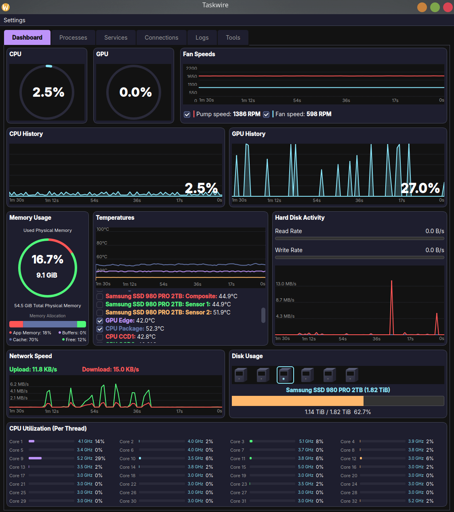
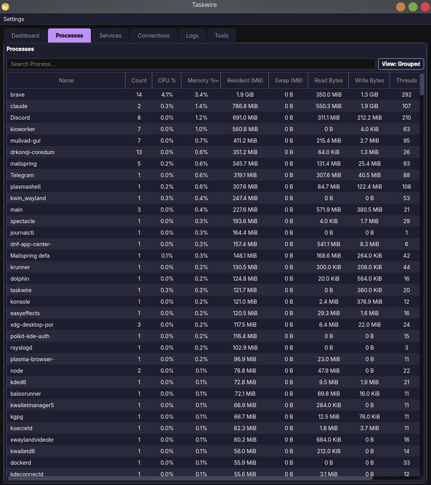
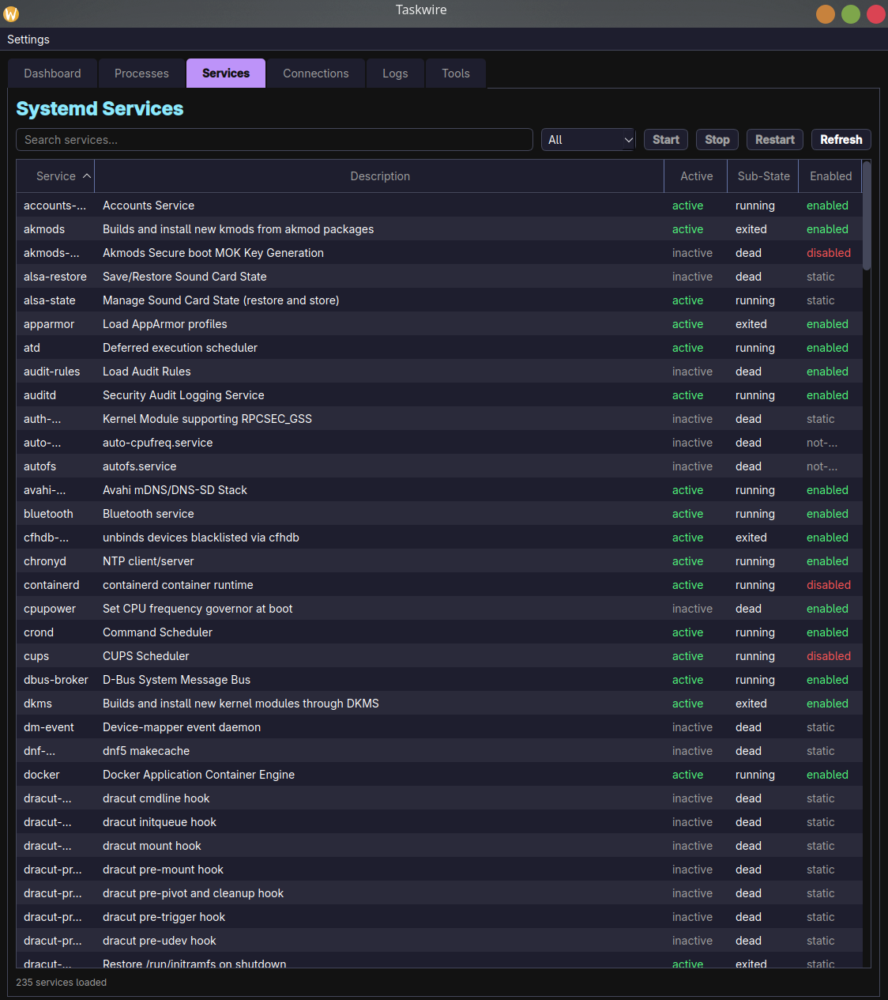
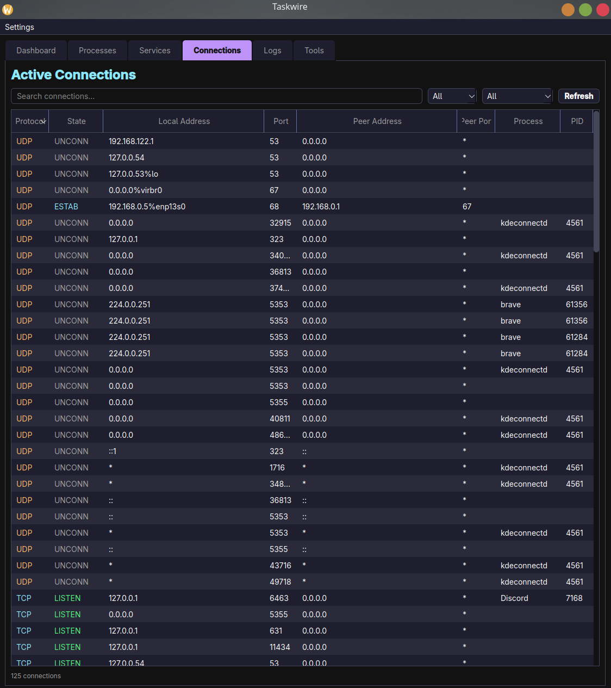
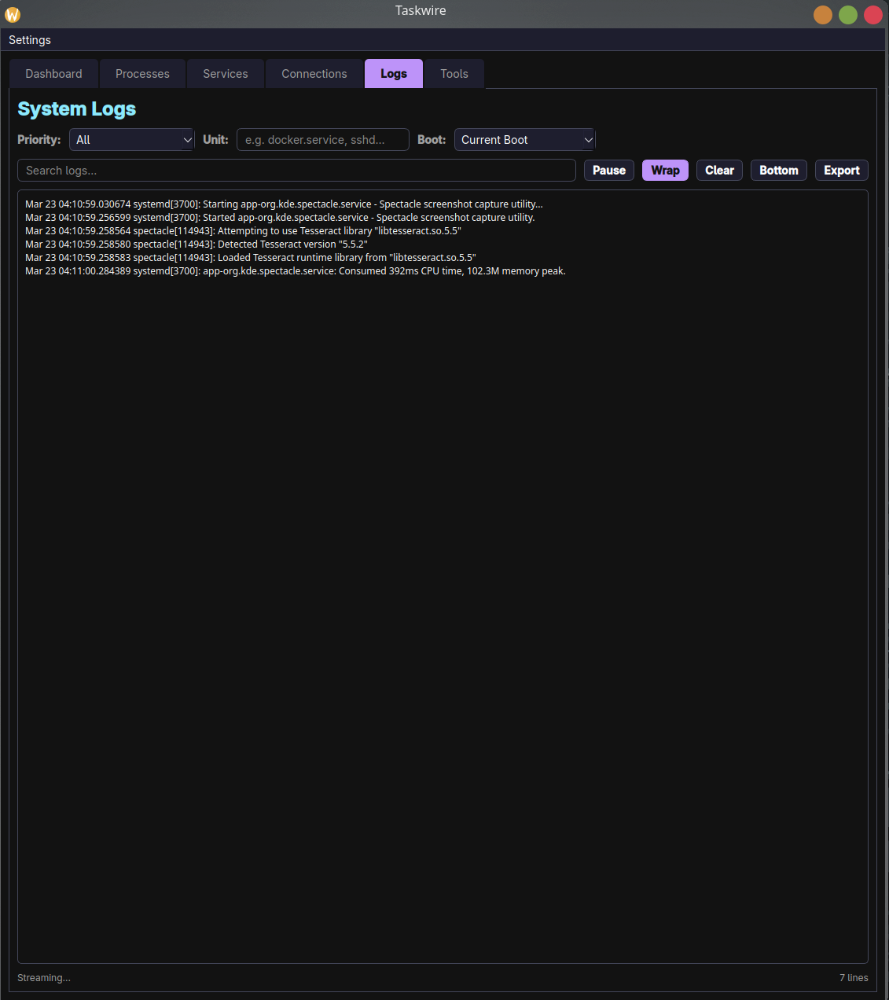
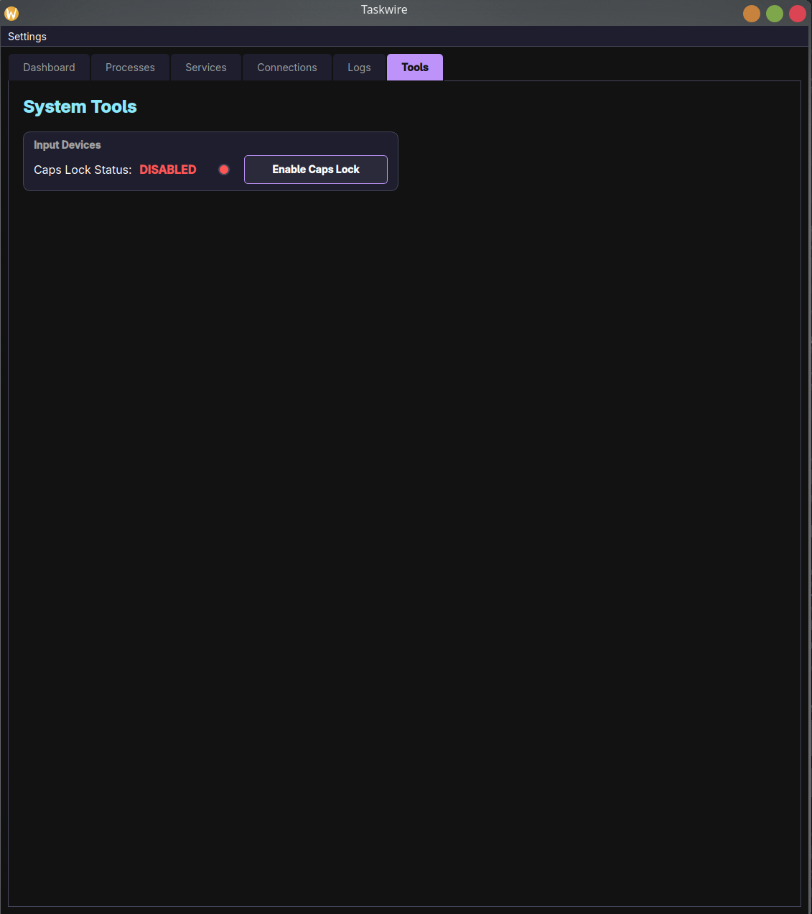

# Taskwire


> **⚠️ Disclaimer:** This is an AI "vibe coded" project, and my first attempt at making something useful with it.

**Taskwire** is a modern, dark-themed system monitor for Linux, designed with a "Video Game HUD" aesthetic. It provides real-time monitoring of your system's performance with a visual style inspired by cyberpunk interfaces and modern desktop widgets.

> **📥 [Download the latest release (AppImage or native binary)](https://github.com/majoraexp/Taskwire/releases)** — No dependencies needed for AppImage!




*Process Manager with grouped view, sortable columns, and Force Kill (Admin).*


*Systemd Services Manager — list, search, and control all services.*


*Active Connections viewer — all TCP/UDP sockets with owning processes.*


*Live System Log Viewer — real-time journalctl streaming with filters and search.*


*System Tools — Caps Lock toggle and more.*

## Why I Made Taskwire / How to Use It

Taskwire gives you a full diagnostic loop across its tabs, so you can go from "something's wrong" to "fixed it" without opening a terminal.

- **Logs** surface the problem in real time.
- **Dashboard** checks system health at a glance.
- **Services** let you stop, restart, enable, or disable the cause.
- **Processes** let you find and kill anything eating resources.
- **Connections** show you what's talking to the network and why.

The whole point is that each tab feeds into the next. Logs tell you what's wrong, Dashboard tells you whether the system is stressed, Services or Processes let you fix it, and Connections covers the network angle. You stay in one window the entire time.

## What's New in v2.0.1

**Adaptive dashboard scaling** — the dashboard now scales gracefully to any display shape. 
  On tall/portrait monitors, every row keeps its landscape proportions and grows uniformly: graphs expand, the memory gauge and
  disk drive icons (and their text) enlarge with their cards, and everything reverts cleanly when the window moves back to a
  smaller display.
**Per-process GPU % column** in the Processes tab (AMD DRM fdinfo engine counters), including GPU usage of protected processes
  like kwin via a one-time admin authorization. 
**Unattributed CPU time** (interrupts, short-lived processes) is now shown in the System / Kernel entry.
**Wildcard search** in Processes, Services, and Connections tabs (fire*, *ssh*), plus a PID column option in the grouped process      view.

Taskwire v2.0.0 (and onward) is a **complete rewrite from Python/PyQt6 to native C++17/Qt6**.

*   **871 KB binary** (vs 51 MB Python bundle) — 98% smaller
*   **~80 MB RAM** (vs ~250 MB Python) — 68% less memory
*   **No GIL contention** — true multi-threaded polling
*   **Direct /proc + /sys parsing** — no psutil dependency, no subprocess overhead
*   **Dark and light themes** with persistent selection and adaptive accent colors
*   **Friendly sensor names** — "CPU Package", "GPU Edge" instead of cryptic kernel labels
*   **Scrollable sensor legends** with per-sensor checkboxes for visibility control
*   **Settings persistence** — theme, column choices, sensor visibility saved across restarts

## Features

*   **HUD-Style Dashboard:** A cohesive, single-window interface with a Dracula-inspired dark theme and neon accents.
*   **Live Monitoring:**
    *   **Extended History:** Customizable graph duration (60s, 90s, **30 Minutes**) for long-term trend spotting.
    *   **CPU:** Overall usage with a large percentage overlay, per-core utilization bars with frequency (MHz/GHz), and live history.
    *   **Memory:** Interactive circular gauge showing Physical Memory (RAM) usage with allocation breakdown legend.
    *   **GPU:** Real-time GPU utilization gauge and history graph (AMD via sysfs, NVIDIA via nvidia-smi).
    *   **Disk:** 3D isometric drive icons for physical disks and a real-time **Read/Write Speed Graph**.
    *   **Network:** Real-time upload and download speed history graph.
    *   **Thermals:** Live temperature graphs for CPU, GPU, and motherboard sensors with per-sensor color coding.
    *   **Fans:** Live RPM monitoring graph for system fans.
    *   **Enhanced Visuals:** X-axis time indicators, vertical hover lines, and dynamic tooltips on all graphs.
*   **Process Manager:**
    *   Full list of running processes.
    *   **Customizable Metrics:** Right-click headers to toggle columns and arrange metrics to your liking.
    *   **Sortable Columns:** Click headers to sort by CPU, Memory, PID, or Name.
    *   **Normalized Memory:** Process memory metrics (Resident, Shared) are dynamically scaled to match system total.
    *   **Swap Monitoring:** Tracks Swap usage per process.
    *   **Grouping:** Collapses multiple processes by name (e.g., "brave (14)") for a cleaner view.
    *   **Process Tree Management:** Kill entire process stacks from the grouped view or use "End Process Tree" in detailed view.
    *   **Force Kill (Admin):** Escalate to root via pkexec for stubborn processes. Batched authentication — only one password prompt for multi-PID kills.
    *   Search functionality.
*   **Systemd Services Manager:**
    *   List all systemd services with real-time status (active/inactive/failed/transitional).
    *   **Start / Stop / Restart / Enable / Disable** services with admin escalation via pkexec.
    *   Search bar and status filter (All / Active / Inactive / Failed).
    *   Color-coded status indicators and state-aware context menu (grays out invalid actions).
    *   Double-click any service for full `systemctl status` output.
    *   Auto-refresh with selection preservation.
*   **Active Connections / Ports Viewer:**
    *   Frontend for `ss` — view all TCP/UDP connections and listening ports.
    *   Columns: Protocol, State, Local Address, Port, Peer Address, Peer Port, Process, PID.
    *   **Protocol filter** (All / TCP / UDP) and **state filter** (LISTEN / ESTAB / UNCONN / CLOSE-WAIT / TIME-WAIT).
    *   Color-coded protocols (TCP=cyan, UDP=orange) and states (LISTEN=green, ESTAB=cyan, closing=orange).
    *   Right-click to copy connection info or kill owning process.
    *   Auto-refresh with selection preservation.
*   **Live System Log Viewer:**
    *   Real-time `journalctl` streaming — no terminal needed.
    *   Filter by priority (Emergency through Debug), systemd unit, and boot session.
    *   Color-coded log lines by severity (red=error, orange=warning, cyan=notice, green=info).
    *   Live search with highlighted matches, pause/resume, word wrap toggle, and jump-to-bottom.
    *   **Export logs** to file with timestamped default filename.
    *   Auto-scroll that pauses when you scroll up to read history, resumes at bottom.
    *   Buffer management: 5,000 line display cap, 10,000 line pause buffer.
*   **System Tools:**
    *   **Caps Lock Toggle:** Global enable/disable switch for the Caps Lock key.
*   **Custom UI:** Built with Qt6 using custom `QPainter` rendering for gauges, graphs, and icons (no image assets required, fully procedural).

## Installation

See [Taskwire_CPP/INSTALL.md](Taskwire_CPP/INSTALL.md) for detailed instructions covering all three methods:

### Option 1: AppImage (recommended for most users)

Download `Taskwire-x86_64.AppImage` from the [releases page](https://github.com/majoraexp/Taskwire/releases), then:

```bash
chmod +x Taskwire-x86_64.AppImage
./Taskwire-x86_64.AppImage
```

No dependencies needed. Works on any Linux distro. ~32 MB.

### Option 2: Native binary (~871 KB)

Download the `taskwire` binary and install Qt6 from your package manager:

```bash
# Fedora / Nobara
sudo dnf install qt6-qtbase qt6-qtbase-gui

# Ubuntu / Debian
sudo apt install qt6-base-dev libqt6widgets6

# Arch / Manjaro
sudo pacman -S qt6-base
```

Then: `chmod +x taskwire && ./taskwire`

### Option 3: Build from source

Requires CMake 3.16+, a C++17 compiler, and Qt6 development headers.

```bash
git clone https://github.com/majoraexp/Taskwire.git
cd Taskwire/Taskwire_CPP
mkdir build && cd build
cmake -DCMAKE_BUILD_TYPE=Release ..
cmake --build . -j$(nproc)
./taskwire
```

## Python Version

The original Python/PyQt6 version is archived and available in earlier releases (v1.55.4 and below). The C++ rewrite is now the primary version.

## Credits
*   **Theme:** Inspired by the [Dracula Theme](https://draculatheme.com/).
*   **Icons:** Procedurally generated via QPainter.

## Contributing

See [CONTRIBUTING.md](CONTRIBUTING.md) for guidelines on how to contribute to this project.

## License

GNU General Public License v3.0
