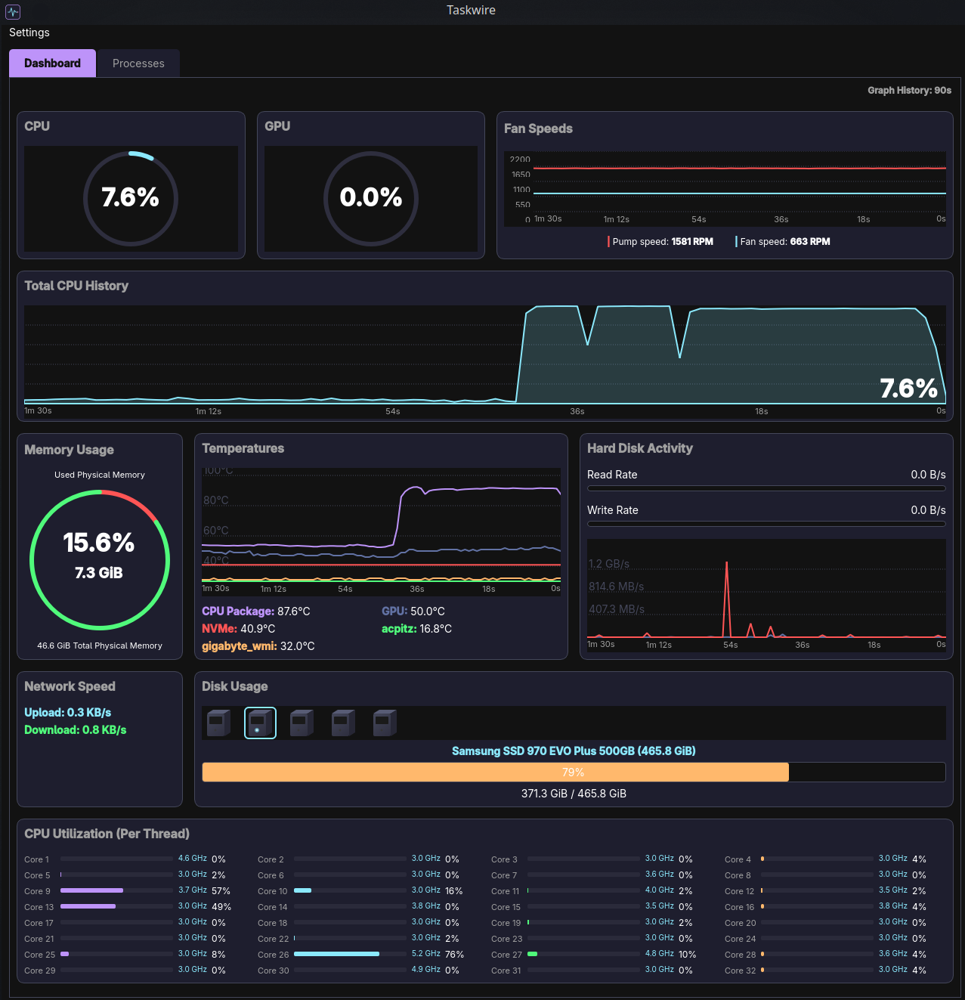
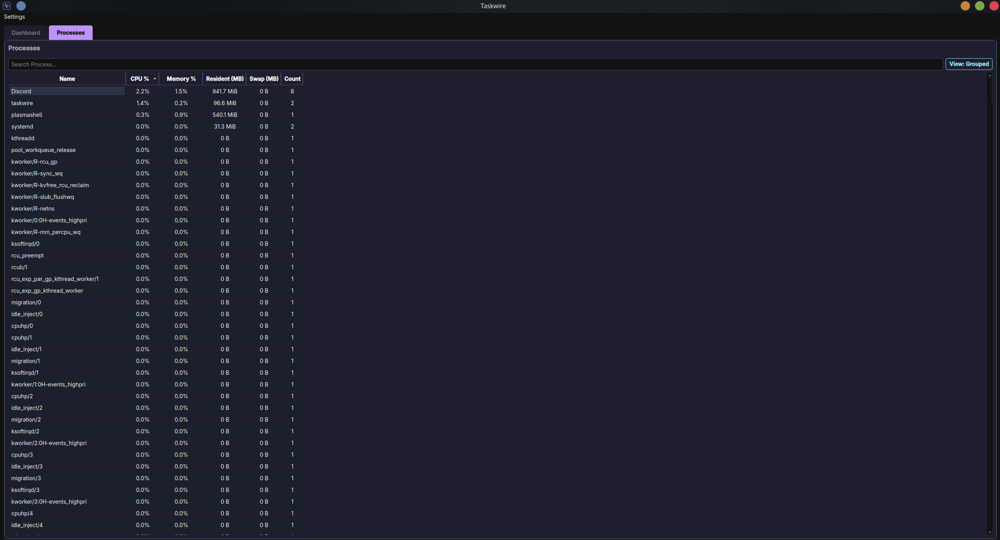

# Taskwire


> **⚠️ Disclaimer:** This is an AI "vibe coded" project, and my first attempt at making something useful with it.

**Taskwire** is a modern, dark-themed system monitor for Linux, designed with a "Video Game HUD" aesthetic. It provides real-time monitoring of your system's performance with a visual style inspired by cyberpunk interfaces and modern desktop widgets.

> **📥 [Download the latest standalone executable (No Python required)](https://github.com/majoraexp/Taskwire/releases)**




*The Process Manager with normalized memory tracking.*

## 🚀 Features

*   **HUD-Style Dashboard:** A cohesive, single-window interface with a Dracula-inspired dark theme and neon accents.
*   **Live Monitoring:**
    *   **CPU:** Overall usage, per-core utilization bars with frequency (MHz/GHz) monitoring, and a 60s history graph.
    *   **Memory:** Interactive circular gauge showing Physical Memory (RAM) usage.
    *   **Disk:** 3D isometric drive icons for physical disks and a real-time **Read/Write Speed Graph**.
    *   **Network:** Real-time upload and download speeds.
    *   **Thermals:** Live temperature graphs for CPU, GPU, and motherboard sensors.
    *   **Fans:** Live RPM monitoring for system fans.
*   **Process Manager:**
    *   Full list of running processes.
    *   **Customizable Metrics:** Right-click headers to toggle columns and arrange metrics to your liking.
    *   **Sortable Columns:** Click headers to sort by CPU, Memory, PID, or Name.
    *   **Normalized Memory:** Process memory metrics (Resident, Shared) are dynamically scaled to match system total.
    *   **Clean Visualization:** Simplified text-based view (no visual clutter) for easier reading of metrics.
    *   **Swap Monitoring:** Tracks Swap usage per process.
    *   **Grouping:** Collapses multiple processes by name (e.g., "firefox (12)") for a cleaner view.
    *   **Process Tree Management:** Kill entire process stacks from the grouped view or use "End Process Tree" in detailed view.
    *   Search functionality.
*   **Custom UI:** Built with PyQt6 using custom `QPainter` rendering for gauges, graphs, and icons (no image assets required, fully procedural).

## 📦 Installation

### Prerequisites
*   Python 3.8+
*   Linux (Tested on Fedora/Nobara, should work on Ubuntu/Debian/Arch)

### Steps

1.  **Clone the repository:**
    ```bash
    git clone https://github.com/yourusername/Taskwire.git
    cd Taskwire
    ```

2.  **Create a virtual environment (Recommended):**
    ```bash
    python3 -m venv venv
    source venv/bin/activate
    ```

3.  **Install dependencies:**
    ```bash
    pip install -r Taskwire/requirements.txt
    ```
    *Dependencies include `PyQt6` and `psutil`.*

4.  **Run the application:**
    ```bash
    python3 Taskwire/main.py
    ```

## 🛠 Building Executable (Linux)

To create a standalone portable executable (AppImage-like binary):

1.  Ensure you have the dev dependencies installed (PyInstaller):
    ```bash
    pip install pyinstaller
    ```

2.  Run the build script:
    ```bash
    ./build_app.sh
    ```

3.  The executable will be located at:
    ```
    Taskwire/dist/Taskwire
    ```

## 🎨 Credits
*   **Theme:** Inspired by the [Dracula Theme](https://draculatheme.com/).
*   **Icons:** Procedurally generated via Python/Pillow.

## 🤝 Contributing

See [CONTRIBUTING.md](CONTRIBUTING.md) for guidelines on how to contribute to this project.

## 📄 License

GNU General Public License v3.0
